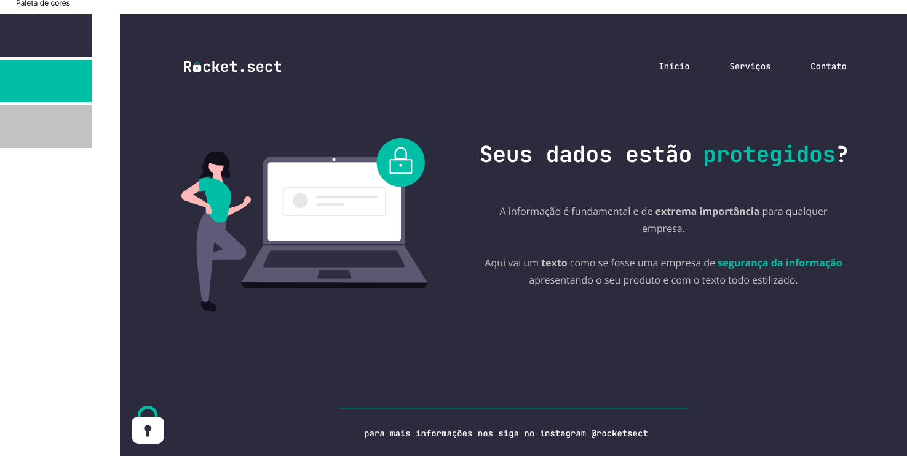

<h1 align="center"> Rocket.sect </h1>

Projeto desenvolvido durante o curso Full Stack da Rocketseat.  

  <a href="#-tecnologias">Tecnologias</a>&nbsp;&nbsp;&nbsp;|&nbsp;&nbsp;&nbsp;
  <a href="#-projeto">Projeto</a>&nbsp;&nbsp;&nbsp;|&nbsp;&nbsp;&nbsp;
  <a href="#memo-licença">Licença</a>

  

 

  

## 🚀 Tecnologias

Esse projeto foi desenvolvido com as seguintes tecnologias:

- HTML e CSS
- Git e Github
- Figma

## 💻 Projeto

O rocket.sect é uma LP para venda de serviços da segurança da informação.

- [Acesse o projeto finalizado, online](https://rouxltda.github.io/explorer-rocket-sect)

## :memo: Licença

Esse projeto está sob a licença MIT.

---

Feito com ♥ by Ayres Roux.
